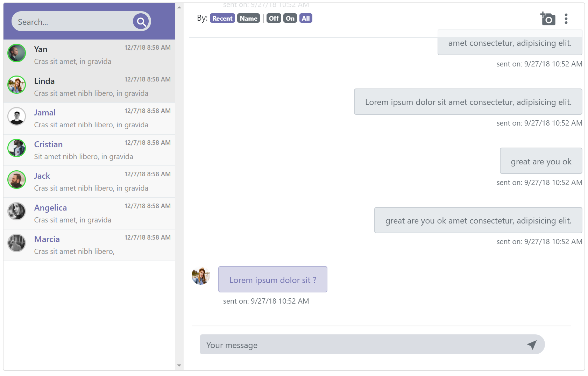
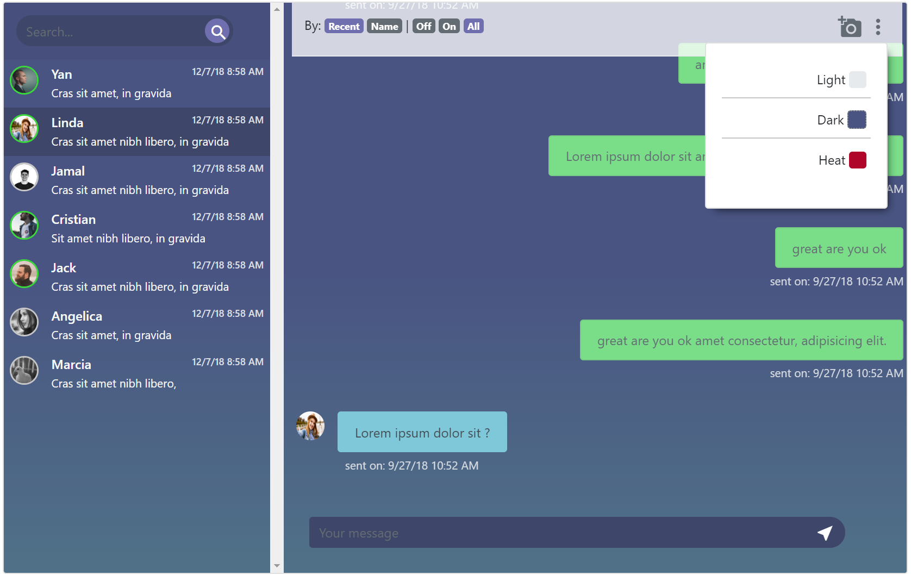

# Simple Chat Theme

It's a simple theme for a application chat, built with html5 css3 and Jquery,where you can switch between different theme

## Example

## Example Dark theme

## Example Heat theme

## Installation

Just Donwload it and use

## Contributing
Pull requests are welcome. For major changes, please open an issue first to discuss what you would like to change.

## License
[MIT](https://choosealicense.com/licenses/mit/)
